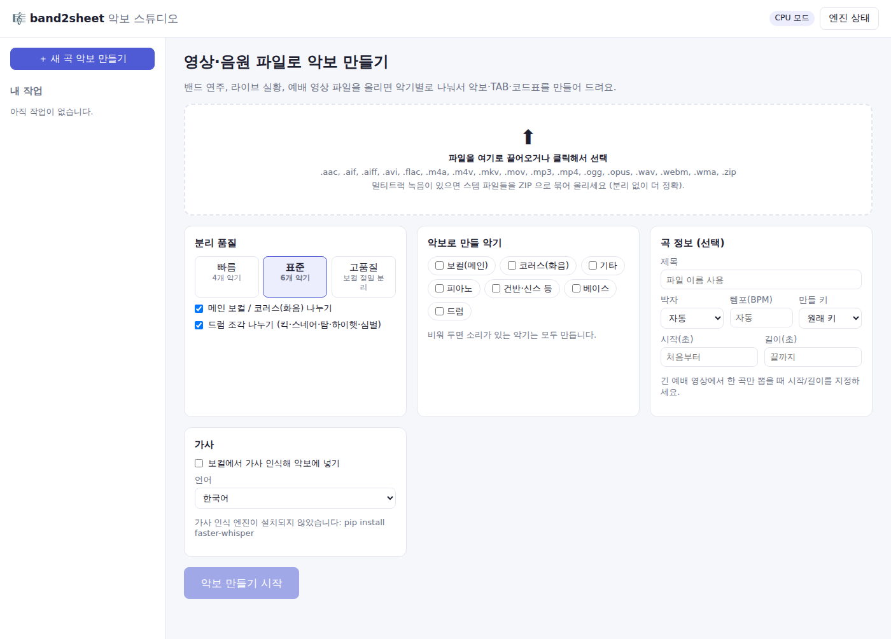
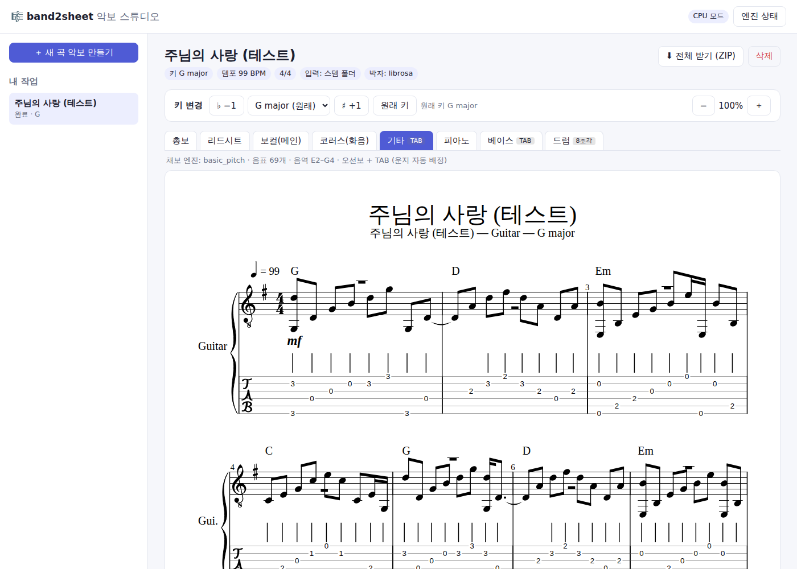
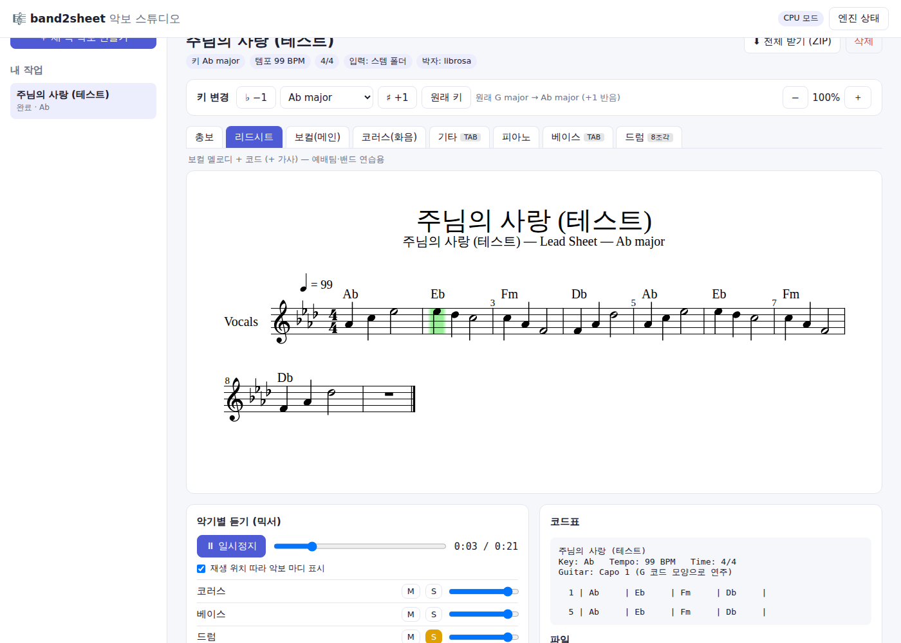

# 🎼 band2sheet 악보 스튜디오

**영상이나 음원 파일을 넣으면 악기별로 나눠서 자동으로 악보를 만들어 주는 앱**입니다.
밴드 연주, 라이브 실황, 예배 영상처럼 여러 악기가 섞인 음원을 분리합니다. 나누는 단위는
**메인 보컬 · 코러스 · 기타 · 피아노 · 건반/신스 · 베이스 · 드럼(킥/스네어/탐/하이햇/심벌)**입니다.
나눈 악기마다 악보·TAB·코드표를 만들고, 키도 버튼 한 번으로 바꿀 수 있습니다.

| 업로드 | 기타 오선보 + TAB | 재생하며 보기 (A♭으로 조옮김) |
|---|---|---|
|  |  |  |

## 무엇을 해 주나요

```
영상/음원 파일 (mp4, mov, mp3, wav, m4a …) 또는 멀티트랙 ZIP
   │
   ├─ ① 분리     BS-RoFormer(보컬) → Demucs 6스템 → 메인/코러스 분리 → 드럼 6조각 분리
   ├─ ② 채보     보컬·베이스: CREPE │ 피아노: ByteDance HR(+페달) │ 기타·건반·코러스: Basic Pitch
   │             드럼: 조각별 타격 검출 (킥·스네어·하이햇 열림/닫힘·탐 3종·라이드·크래시)
   ├─ ③ 분석     Beat This!(마디 첫 박·박자표) · 키 감지 · 코드 진행 · (선택) Whisper 가사
   └─ ④ 악보     총보 · 리드시트(멜로디+코드+가사) · 악기별 파트보 · TAB · 코드표 · MIDI
                 → 원하는 키로 즉시 조옮김
```

### 악기별 상세 표기

| 악기 | 표기 |
|---|---|
| 메인 보컬 | 멜로디, 음절 단위 가사(한국어는 한 음표에 한 글자), 남성 음역은 옥타브 아래 높은음자리표 |
| 코러스(화음) | 별도 파트 — 성가대·싱어 화음 연습용 |
| 기타 | 오선보 + **6줄 TAB**: 줄·프렛을 손 이동이 가장 적게 자동 배정, 개방현 선호, 카포 추천 |
| 베이스 | 오선보 + **4줄 TAB** |
| 피아노·건반 | 큰보표, 고정 분할점 대신 **손 위치를 따라가는 양손 분리**, **서스테인 페달**(Ped. ✱) |
| 드럼 | 표준 드럼 키트 기보: 손(위 성부)과 발(아래 성부) 2성부, 하이햇 열림(o)/닫힘, 탐 하이/미드/플로어, 크래시·라이드 |
| 공통 | 셈여림(pp~ff), 템포, 박자표, 코드 이름, 마디 번호 |

설치된 엔진에 따라 자동으로 더 좋은 방법을 고릅니다. 모델을 내려받지 못하면 그 단계만 기본 방법으로 대체하고 계속 진행합니다.
`band2sheet engines` 로 설치 상태를 확인할 수 있습니다. 조사한 오픈소스 목록과 앞으로 붙일 후보는
[docs/OPEN_SOURCE.md](docs/OPEN_SOURCE.md) 에 있습니다.

## 설치

**준비물**: Python 3.10 또는 3.11, [ffmpeg](https://ffmpeg.org/download.html)
(선택) PDF 출력용 [MuseScore](https://musescore.org) (무료)

```bash
git clone <이 저장소>
cd <저장소 폴더>
python -m venv .venv && source .venv/bin/activate     # Windows: .venv\Scripts\activate

pip install -e ".[all]"       # 전부 (분리 + 상세 엔진 + 가사 + 앱)
# 또는 필요한 것만:
pip install -e ".[ml,app]"    # 기본 분리·채보 + 앱
pip install -e ".[detail]"    # 메인/코러스·드럼 조각 분리, CREPE, 피아노 페달, 다운비트
pip install -e ".[lyrics]"    # 가사 인식
```

- 처음 실행할 때 분리·채보 모델(수백 MB~1GB)을 자동으로 내려받습니다. 모델은 `~/.cache` 와 `BAND2SHEET_MODEL_DIR` 에 저장됩니다.
- NVIDIA GPU(CUDA)나 Apple Silicon(MPS)이 있으면 자동으로 써서 훨씬 빠릅니다. CPU 로도 됩니다(5분 곡 기준 수 분~십수 분).

## 앱 사용법

```bash
band2sheet app            # 브라우저에서 http://127.0.0.1:8765 이 열립니다
```

1. 영상/음원 파일을 끌어다 놓습니다. 멀티트랙 녹음이 있으면 스템 파일들을 ZIP 으로 묶어서 올립니다.
2. 품질(빠름/표준/고품질)과 세부 분리(메인·코러스, 드럼 조각)를 고릅니다. 만들 악기와 시작·길이 구간도 고를 수 있는데, 긴 예배 영상에서 한 곡만 뽑을 때 씁니다.
3. **악보 만들기 시작** 을 누르면 진행률이 보입니다. 작업은 데이터 폴더(`~/band2sheet-data`)에 저장돼 나중에 다시 열 수 있습니다.
4. 결과 화면에서 할 수 있는 것:
   - **탭**: 총보 / 리드시트 / 악기별 악보 (기타·베이스는 TAB 포함)
   - **키 변경**: 목록에서 키 선택 또는 ♭−1 / ♯+1 (분석을 다시 하지 않아 몇 초 만에 바뀝니다)
   - **믹서**: 악기별 음소거(M)·솔로(S)·볼륨. 재생 위치에 맞춰 악보의 현재 마디를 표시합니다
   - **코드표**: 마디별 코드와 가사, 기타 카포 추천
   - **받기**: MusicXML(MuseScore·Finale·Sibelius·Dorico에서 열기), MIDI, 코드표, ZIP 전체

같은 와이파이의 휴대폰·태블릿에서 보려면 `band2sheet app --host 0.0.0.0` 으로 실행하고 `http://<컴퓨터 IP>:8765` 로 접속하세요.

## 명령줄 사용법

```bash
band2sheet run 예배실황.mp4 --key A --lyrics               # 파일 → 악보 (+A키 악보, 가사)
band2sheet run 곡.mp3 -q high                              # 고품질 분리
band2sheet run --stems-dir 멀티트랙폴더/                    # 멀티트랙 (분리 없이)
band2sheet transpose output/곡/project.json --key Bb       # 분석 결과로 빠르게 조옮김
band2sheet transpose 내악보.musicxml --key G               # 기존 MusicXML 조옮김
band2sheet run "https://youtu.be/..."                      # (명령줄 전용) 유튜브 링크
band2sheet engines                                         # 엔진 설치 상태
```

| 옵션 | 설명 |
|---|---|
| `-q fast/standard/high` | 분리 품질 (4스템 / 6스템 / RoFormer 보컬 + 6스템) |
| `--no-split-vocals`, `--no-split-drums` | 메인/코러스, 드럼 조각 분리 끄기 |
| `--stems vocals,bass,drums` | 원하는 악기만 채보 |
| `--start 60 --duration 90` | 1분 지점부터 90초만 |
| `--bpm 72`, `--time-sig 3/4`, `--downbeat 1` | 템포·박자·마디 첫 박을 직접 지정 (자동 인식이 틀릴 때) |
| `--grid 2` | 리듬을 8분음표 단위로 단순화 (기본 4 = 16분음표, 3 = 셋잇단) |
| `--vocal-engine crepe/pyin/basic_pitch` | 보컬 채보 방식 |
| `--pdf` | MuseScore 가 있으면 PDF 도 생성 |

### 멀티트랙 폴더/ZIP 파일 이름 규칙

파일 이름으로 악기를 알아봅니다. 대소문자는 구분하지 않습니다.

| 악기 | 인식하는 이름 |
|---|---|
| 메인 보컬 | `vocal`, `vox`, `lead`, `보컬` |
| 코러스 | `bgv`, `backing`, `chorus`, `choir`, `코러스` |
| 기타 / 베이스 / 피아노 | `guitar`·`gtr` / `bass` / `piano`·`keys` |
| 건반·신스 | `synth`, `pad`, `organ`, `string` |
| 드럼 조각 | `kick`, `snare`, `hihat`·`hh`, `tom 1`·`tom 2`·`floor`, `ride`, `crash` (또는 `drums/` 폴더 안) |

## 결과물

```
작업 폴더/
├── project.json        # 분석 결과 (조옮김 재사용)
├── stems/              # 분리된 악기별 음원 (+ stems/drums/ 드럼 조각)
├── preview/            # 앱 믹서용 MP3
├── sheets_G/           # 원래 키
│   ├── full_score.musicxml, lead_sheet.musicxml
│   ├── vocals / backing_vocals / guitar(+TAB) / piano / other / bass(+TAB) / drums .musicxml
│   ├── chords.txt      # 마디별 코드표 (+가사, 카포 추천)
│   └── midi/           # 악기별 MIDI + all.mid
└── sheets_A/           # 조옮김한 악보
```

## 정확도와 팁

자동 채보는 **초안**을 빠르게 만드는 도구입니다. MuseScore 에서 열어 다듬는 흐름을 권장합니다.

- 정확도 순서: 스튜디오 음원 > 깨끗한 라이브 > 현장 녹음(관객 소리, 잔향 많음). **멀티트랙이 있으면 가장 정확합니다.**
- 템포가 2배/절반으로 잡히면 `--bpm`, 마디가 밀리면 `--downbeat` 로 고칩니다. 앱에서는 템포를 직접 입력하면 됩니다.
- 피아노·기타 반주는 읽기 쉽게 한 성부로 정리합니다. 드럼 탐/심벌은 조각 분리(DrumSep)가 있을 때 가장 정확합니다.

> ⚠️ 저작권: 음원과 만든 악보는 개인 연습·연구 용도로 쓰세요. 배포하거나 공연할 때는 저작권(예: CCLI 라이선스)을 확인하세요.

## 개발

```bash
pip install -e ".[all,dev]"
pytest                    # 전체 테스트 (합성 밴드 음원으로 분석→악보→앱 API 까지 검증)
pytest -m "not slow"      # 빠른 테스트만
```

| 모듈 | 역할 |
|---|---|
| `separate.py` | 다단계 분리 (Demucs, RoFormer, Karaoke, DrumSep), 멀티트랙 인식 |
| `transcribe.py` | 채보 엔진 (CREPE, pYIN, Basic Pitch, 피아노 HR, 드럼) |
| `rhythm.py` | 비트/다운비트 (Beat This!, librosa), 박자표 추정 |
| `chords.py`, `theory.py` | 코드 인식, 키 감지, 조옮김, 음 이름 표기 |
| `score.py`, `notation.py` | 양자화·악보 생성, TAB 운지, 양손 분리, 페달, 셈여림, 드럼 키트 |
| `lyrics.py` | WhisperX / faster-whisper 가사, 음절-음표 정렬 |
| `pipeline.py` | 전체 흐름, MIDI·코드표 |
| `engines.py` | 엔진 설치 확인, 장치 선택 |
| `app/` | 앱 서버(FastAPI, 작업 큐) + 화면(OpenSheetMusicDisplay 악보 뷰어, 믹서) |
| `cli.py` | 명령줄 |
