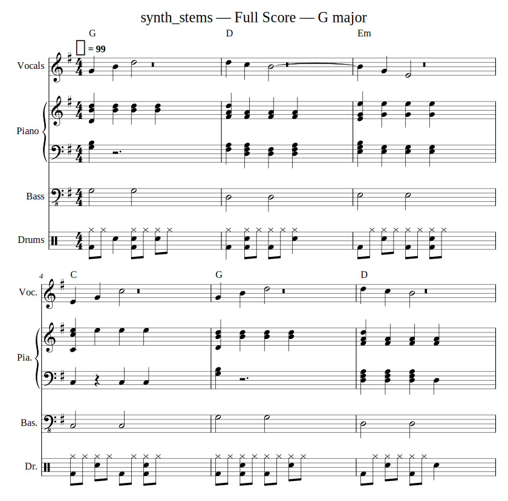
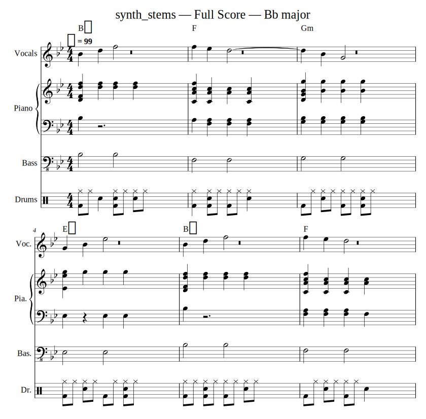

# 🎼 band2sheet

**유튜브 링크나 음원 파일을 넣으면 악기별로 나눠서 자동으로 악보를 만들어 주는 프로그램**입니다.
밴드 연주, 라이브 실황, 예배 영상처럼 여러 악기가 섞인 음원을 **보컬 · 드럼 · 베이스 · 기타 · 피아노 · 건반/신스**로
분리한 뒤, 악기마다 악보(MusicXML · MIDI)와 코드표를 만들고 **원하는 키로 바로 조옮김**할 수 있습니다.

```
유튜브 링크 / mp3 / mp4
      │  ① 다운로드·변환 (yt-dlp, ffmpeg)
      ▼
   믹스 음원 ──② 악기별 분리 (Demucs htdemucs_6s)──▶ vocals / drums / bass / guitar / piano / other
                                                          │
      ③ 채보: 보컬·베이스 = pYIN 멜로디 추적, 기타·피아노·건반 = Basic Pitch 다성 채보,
              드럼 = 대역별 타격 검출 (킥 / 스네어 / 하이햇)
      ④ (선택) 가사 인식: Whisper 로 보컬에서 가사 추출 → 음표에 음절 단위로 배치
      ⑤ 분석: 템포·비트 추적(라이브 템포 흔들림 반영), 마디 첫 박, 키 감지, 코드 진행 인식
                                                          │
                                                   project.json (분석 결과 저장)
                                                          │
      ⑥ 렌더링: 박자 양자화 → 악보 정리 → 조옮김 → MusicXML / MIDI / 코드표 / (PDF)
```

## 예시

테스트용 합성 밴드 음원(G장조, G–D–Em–C 진행, 보컬·피아노·베이스·드럼)을 넣어 자동으로 만든 총보와,
같은 분석 결과를 `--key Bb` 로 조옮김한 악보입니다.

| 원래 키 (G) | B♭ 으로 조옮김 |
|---|---|
|  |  |

## 주요 기능

| 기능 | 내용 |
|---|---|
| 입력 | 유튜브 URL, 오디오(mp3/wav/flac/m4a…), 영상(mp4…) 파일, 이미 분리된 멀티트랙 폴더 |
| 음원 분리 | Demucs 6스템: 보컬, 드럼, 베이스, 기타, 피아노, 기타 악기(건반·신스·현악 등) |
| 악보 | 악기별 파트보, 전체 총보(full score), 리드시트(멜로디 + 코드 + 가사) |
| 코드 인식 | 마디/박 단위 코드 진행 (메이저, 마이너, 7, maj7, m7, sus2/4, dim, 슬래시 코드 예: D/F#) |
| 가사 인식 | (선택) 한국어 등 다국어. 한국어는 음표마다 한 음절씩 배치 |
| 키 변경 | `--key Bb` 처럼 목표 키 지정 또는 `-s +2` 반음 이동. 조표와 음 이름(♯/♭)을 새 키에 맞게 표기 |
| 빠른 재조옮김 | 무거운 분석은 한 번만 — `project.json` 으로 다른 키 악보를 몇 초 만에 다시 생성 |
| 결과 형식 | MusicXML(MuseScore·Finale·Sibelius·Dorico 등에서 열기/수정/인쇄), MIDI, 텍스트 코드표, PDF(MuseScore 설치 시) |
| 사용 방법 | 명령줄(CLI)과 웹 화면(Gradio) 둘 다 지원 |

## 설치

**준비물**: Python 3.10 또는 3.11 권장, [ffmpeg](https://ffmpeg.org/download.html)
(선택) PDF 출력과 악보 확인용 [MuseScore](https://musescore.org) (무료)

```bash
git clone <이 저장소>
cd <저장소 폴더>
python -m venv .venv && source .venv/bin/activate     # Windows: .venv\Scripts\activate

pip install -e ".[ml]"          # 기본 (분리 + 채보)
pip install -e ".[all]"         # 전체 (가사 인식 + 웹 화면 포함)
```

- 처음 실행할 때 Demucs 분리 모델(수백 MB)을 자동으로 내려받습니다.
- NVIDIA GPU(CUDA)나 Apple Silicon(MPS)이 있으면 자동으로 사용해 훨씬 빠릅니다. CPU 만으로도 동작합니다
  (5분 곡 기준 CPU 에서 수 분 정도).

## 사용법

### 1) 유튜브 링크로 악보 만들기

```bash
band2sheet run "https://www.youtube.com/watch?v=XXXXXXXX" -o output/주님의사랑
```

### 2) 파일로 + 키 변경 + 가사 인식

```bash
band2sheet run 예배실황.mp4 --key A --lyrics --lang ko
```

원래 키 악보와 A 키 악보가 모두 만들어집니다.

### 3) 이미 만든 분석 결과로 다른 키 악보 만들기 (몇 초)

```bash
band2sheet transpose output/주님의사랑/project.json --key Bb
band2sheet transpose output/주님의사랑/project.json -s -2          # 2반음 내리기
band2sheet transpose output/주님의사랑/project.json --key E --direction down
```

### 4) 이미 있는 MusicXML 악보 조옮김 (MuseScore 에서 손본 악보 등)

```bash
band2sheet transpose 내악보.musicxml --key G
```

### 5) 웹 화면

```bash
band2sheet web            # 브라우저에서 http://127.0.0.1:7860 열기
```

링크를 붙여넣거나 파일을 올리고 **악보 만들기** → 결과 파일과 코드표가 나옵니다.
키를 바꾸고 **이 키로 다시 만들기**를 누르면 분석을 다시 하지 않고 바로 조옮김됩니다.

### 자주 쓰는 옵션

| 옵션 | 설명 |
|---|---|
| `--stems vocals,bass,piano` | 원하는 악기만 채보 |
| `--stems-dir 폴더` | 멀티트랙 녹음이나 이미 분리된 스템 사용 (파일 이름에 vocal/drum/bass/guitar/piano/keys… 포함) |
| `--start 60 --duration 90` | 1분 지점부터 90초만 사용 (긴 예배 영상에서 한 곡만) |
| `--bpm 72` | 템포 직접 지정 (자동 인식이 2배/절반으로 잡혔을 때) |
| `--time-sig 3/4` / `6/8` | 박자표 지정 (기본 4/4) |
| `--downbeat 1` | 마디 첫 박 위치가 어긋났을 때 수동 지정 (0부터) |
| `--grid 2` | 리듬을 8분음표 단위로 단순화 (기본 4 = 16분음표, 3 = 셋잇단) |
| `--model htdemucs` | 4스템(보컬/드럼/베이스/기타악기) 빠른 모델 |
| `--vocal-engine basic_pitch` | 보컬 채보 방식 변경 (기본 pyin) |
| `--pdf` | MuseScore 가 설치돼 있으면 PDF 도 생성 |
| `--no-chords` | 코드 인식 끄기 |

`band2sheet keys G -k Bb` 처럼 키 계산기도 있습니다 (G major → Bb major : +3 반음).

## 결과물

```
output/곡이름/
├── project.json            # 분석 결과 (조옮김 재사용용)
├── stems/                  # 분리된 악기별 음원 (vocals.wav, drums.wav ...)
├── sheets_G/               # 원래 키 악보
│   ├── full_score.musicxml # 총보
│   ├── lead_sheet.musicxml # 리드시트: 멜로디 + 코드 + 가사
│   ├── vocals.musicxml     # 악기별 파트보
│   ├── piano.musicxml      #   (피아노·건반은 큰보표)
│   ├── bass.musicxml
│   ├── guitar.musicxml
│   ├── drums.musicxml      # 킥/스네어/하이햇
│   ├── chords.txt          # 마디별 코드표 (+가사)
│   └── midi/               # 악기별 MIDI + all.mid (DAW 에서 바로 사용)
└── sheets_Bb/              # 조옮김한 악보
```

`chords.txt` 예시:

```
Key: G   Tempo: 99 BPM   Time: 4/4

  1 | G      | D      | Em     | C      |
      주님의   사랑이   나를감   싸네요
```

## 정확도와 팁

자동 채보는 **초안**을 빠르게 만들어 주는 도구입니다. 결과 MusicXML 을 MuseScore 에서 열어 다듬는 흐름을 권장합니다.

- 스튜디오 음원 > 깨끗한 라이브 > 현장 녹음(관객 소리, 잔향 많음) 순으로 정확도가 좋습니다.
- 템포가 2배/절반으로 잡히면 `--bpm`, 마디 시작이 한두 박 밀리면 `--downbeat` 로 고치세요.
- 코드 진행은 기타·피아노·건반·베이스를 종합해 추정합니다. 보컬 멜로디와 베이스 라인이 가장 정확한 편이고,
  피아노·기타는 한 성부로 단순화해서 표기합니다.
- 드럼은 킥/스네어/하이햇 3가지만 구분합니다 (탐/심벌은 아직 미지원).
- 예배팀처럼 멀티트랙 녹음이 있다면 `--stems-dir` 로 분리 단계 없이 훨씬 정확하게 채보할 수 있습니다.

> ⚠️ 저작권: 내려받은 음원과 만든 악보는 개인 연습·연구 용도로 사용하고, 배포·공연 시에는 저작권(예: CCLI 라이선스)을 확인하세요.

## 개발

```bash
pip install -e ".[ml,dev]"
pytest                    # 전체 테스트 (합성 음원으로 분석~악보까지 검증 포함)
pytest -m "not slow"      # 빠른 테스트만
```

| 모듈 | 역할 |
|---|---|
| `audio_io.py` | 유튜브 다운로드(yt-dlp), ffmpeg 변환 |
| `separate.py` | Demucs 음원 분리, 스템 폴더 인식 |
| `transcribe.py` | 채보 엔진 (Basic Pitch, pYIN, 드럼 검출) 및 후처리 |
| `rhythm.py` | 비트 추적, 마디 첫 박 추정 |
| `chords.py` | 코드 인식 (템플릿 매칭 + 비터비) |
| `lyrics.py` | Whisper 가사 인식, 음절-음표 정렬 |
| `theory.py` | 키 감지, 조옮김 계산, 조에 맞는 음 이름 표기 |
| `score.py` | 양자화·음 길이 정리·music21 악보 생성 |
| `pipeline.py` | 전체 흐름, MIDI/코드표 출력 |
| `xml_transpose.py` | 기존 MusicXML 조옮김 |
| `cli.py`, `web.py` | 명령줄 / 웹 화면 |

### 앞으로 해 볼 만한 것

- 기타 TAB 악보, 카포 위치 추천
- 탐·크래시·라이드 등 드럼 세분화
- 피아노 양손/다성부 분리 표기, 셋잇단·스윙 리듬 자동 인식
- 곡 구조(전주/절/후렴) 인식과 반복 기호
