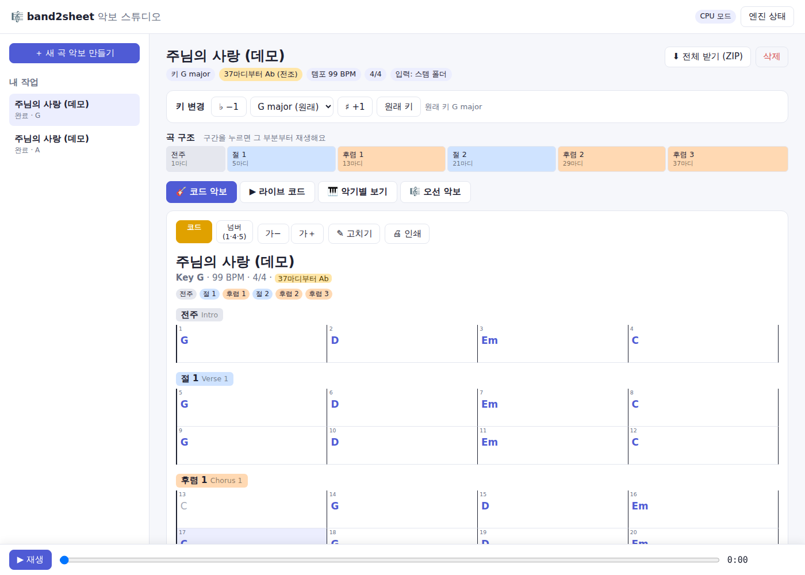
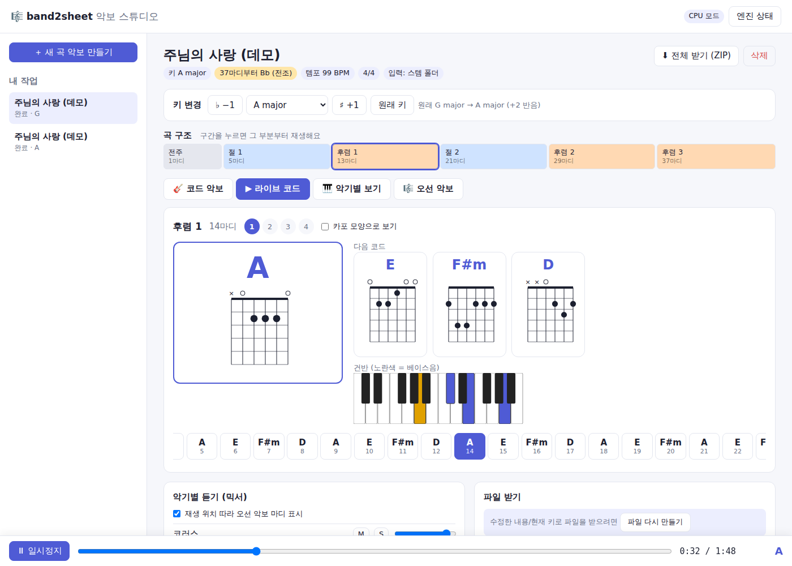
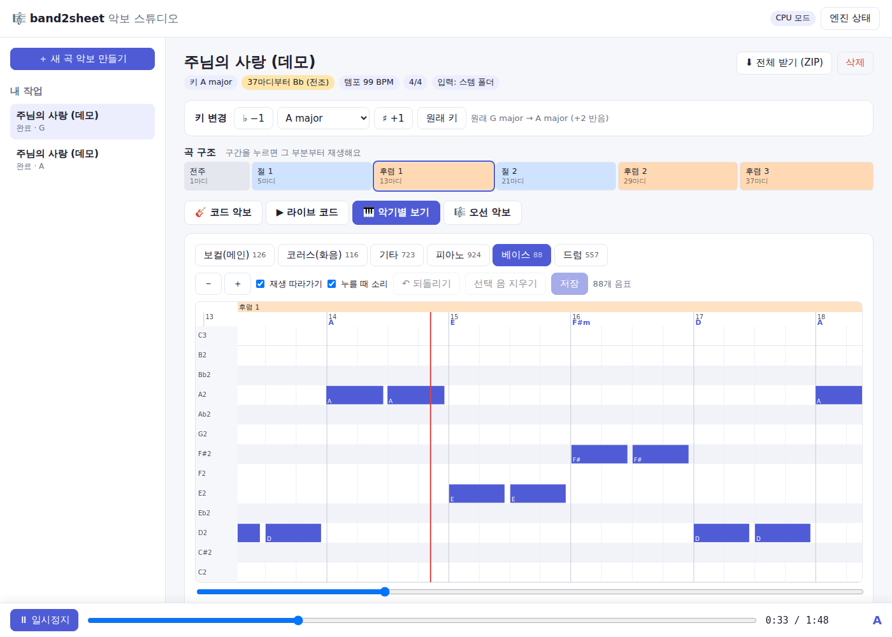
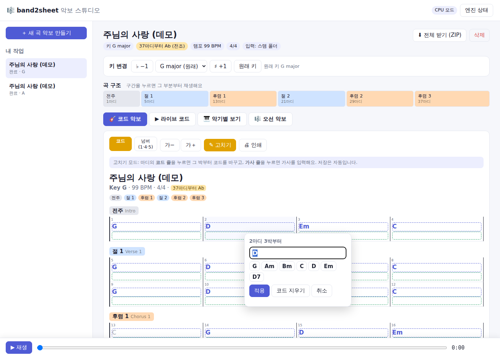
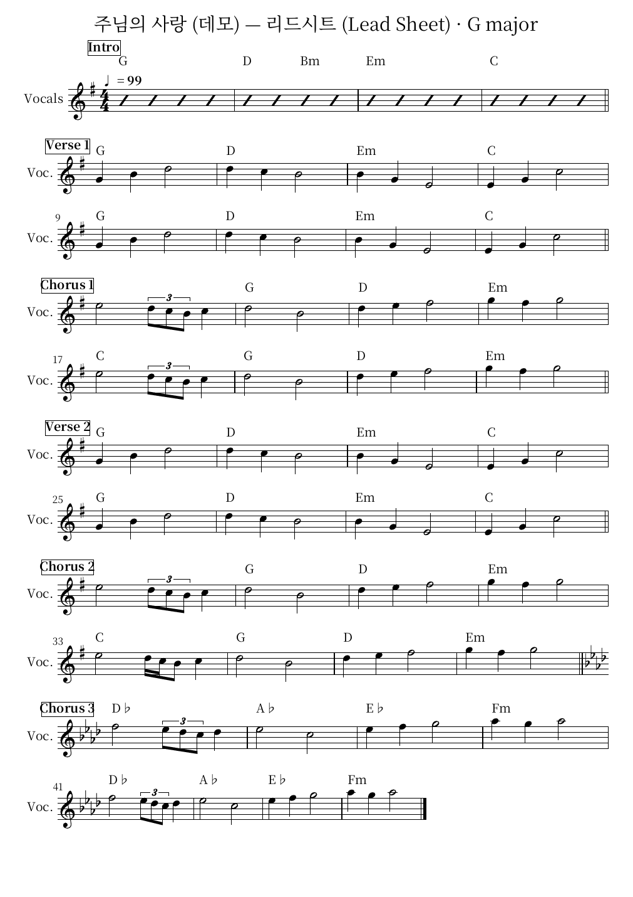

# 🎼 band2sheet 악보 스튜디오

**영상이나 음원 파일을 넣으면 악기별로 나눠서 자동으로 악보를 만들어 주는 앱**입니다.
밴드 연주, 라이브 실황, 예배 영상처럼 여러 악기가 섞인 음원을 분리합니다. 나누는 단위는
**메인 보컬 · 코러스 · 기타 · 피아노 · 건반/신스 · 베이스 · 드럼(킥/스네어/탐/하이햇/심벌)**입니다.
나눈 악기마다 악보·TAB·코드표를 만들고, 키도 버튼 한 번으로 바꿀 수 있습니다.

**MuseScore 같은 외부 프로그램 없이** 앱 안에서 바로 보고, 연습하고, 고칠 수 있습니다.
찬양팀 스타일 코드 악보, 지금/다음 코드를 크게 보여주는 라이브 화면, 악기별 피아노롤·드럼 그리드를 제공하고,
코드·가사·음표를 그 자리에서 고칠 수 있습니다. 오선 악보(MusicXML)도 필요하면 볼 수 있습니다.

| 코드 악보 (구간·코드·가사) | 라이브 코드 (운지 그림·건반) |
|---|---|
|  |  |
| **악기별 보기 (피아노롤 편집)** | **코드 고치기** |
|  |  |

## 무엇을 해 주나요

```
유튜브 링크 · 영상/음원 파일 (mp4, mov, mp3, wav, m4a …) · 멀티트랙 ZIP
   │
   ├─ ⓪ 받기     (링크) yt-dlp 로 음성만 다운로드 (선택: 영상 mp4 도) → ffmpeg 로 음성 추출
   ├─ ① 분리     BS-RoFormer(보컬) → Demucs 6스템 → 메인/코러스 분리 → 드럼 6조각 분리
   ├─ ② 채보     보컬·베이스: CREPE │ 피아노: ByteDance HR(+페달) │ 기타·건반·코러스: Basic Pitch
   │             드럼: 조각별 타격 검출 (킥·스네어·하이햇 열림/닫힘·탐 3종·라이드·크래시)
   ├─ ③ 분석     Beat This!(마디 첫 박·박자표) · 키 감지 · 코드 진행 · (선택) Whisper 가사
   └─ ④ 악보     총보 · 리드시트(멜로디+코드+가사) · 악기별 파트보 · TAB · 코드표 · MIDI
                 → 원하는 키로 즉시 조옮김
```

### 악기별 상세 표기

| 악기 | 표기 |
|---|---|
| 메인 보컬 | 멜로디, 음절 단위 가사(한국어는 한 음표에 한 글자), 남성 음역은 옥타브 아래 높은음자리표 |
| 코러스(화음) | 별도 파트 — 성가대·싱어 화음 연습용 |
| 기타 | 오선보 + **6줄 TAB**: 줄·프렛을 손 이동이 가장 적게 자동 배정, 개방현 선호, 카포 추천 |
| 베이스 | 오선보 + **4줄 TAB** |
| 피아노·건반 | 큰보표, 고정 분할점 대신 **손 위치를 따라가는 양손 분리**, **서스테인 페달**(Ped. ✱) |
| 드럼 | 표준 드럼 키트 기보: 손(위 성부)과 발(아래 성부) 2성부, 하이햇 열림(o)/닫힘, 탐 하이/미드/플로어, 크래시·라이드 |
| 공통 | 셈여림(pp~ff), 템포, 박자표, 코드 이름, 마디 번호 |

### 분리 결과 정리 (분할)

분리 모델이 내놓은 스템에는 다른 악기 소리가 조금씩 섞여 있고(블리딩), 이 소리가 가짜 음표가 됩니다. 이를 줄이려고 다음 일을 합니다.

- **악기별 연주 구간**: 스템과 '나머지 전체'의 스펙트럼을 비교해, 그 악기만의 소리가 있는 구간을 찾습니다. 예를 들어 후렴에서만 나오는 기타나 코러스를 구분합니다. 연주하지 않는 구간의 음표는 지웁니다.
- **음표 단위 블리딩 검증**: 음표의 배음 위치 에너지가 '새어 들어온 양'보다 충분히 큰지 확인합니다.
- **옥타브 유령음 제거**: 기본음 주파수에 에너지가 없는 아래 유령음과, 훨씬 약한 위쪽 배음 유령음을 지웁니다.
- **반복 타격 보존**: 같은 음을 다시 친 경우(기타 스트로크, 피아노 반복 화음)는 한 음으로 합치지 않습니다.
- 고품질 모드에서는 Demucs 를 여러 번 돌려 평균을 냅니다(shifts).

합성 곡(블리딩 −28 dB, 정답 음표를 알고 있음)으로 측정한 F1 점수입니다:

| 스템 | 정리 전 | 정리 후 |
|---|---|---|
| 코러스 | 0.21 | **0.80** |
| 기타 | 0.55 | **0.85** |
| 피아노 | 0.54 | **0.63** |
| 보컬 / 베이스 (CREPE) | 1.00 | 1.00 |

### 악보 구현

- **곡 구조**: 전주·절·프리코러스·후렴·브리지·간주·후주를 자동으로 나눕니다. 악보에는 구간 이름 상자와 겹세로줄을 넣고, 코드표도 구간별로 정리합니다.
- **전조**: 곡 중간에 키가 바뀌면(예: 마지막 후렴 반음 올림) 그 마디에 새 조표를 넣습니다. 음표와 코드 이름도 바뀐 키에 맞게 적고, 조옮김할 때 함께 옮깁니다.
- **셋잇단**: 박마다 16분음표 격자와 셋잇단 격자 중 더 잘 맞는 쪽을 자동으로 고릅니다. 비트 추적의 위상 오차도 보정합니다.
- **못갖춘마디**: 곡이 첫 박이 아닌 곳에서 시작하면 짧은 0번 마디로 적습니다.
- **마디 첫 박**: 킥·베이스뿐 아니라 '코드가 바뀌는 위치'까지 보고 정합니다.
- **내슈빌 넘버 코드표** (`chords_nashville.txt`): 1·4·5·6m 처럼 적습니다. 키가 바뀌어도 같은 숫자라 예배팀에 편합니다.
- **PDF**: MuseScore 가 없어도 Verovio 로 PDF 악보를 만듭니다 (`pip install -e ".[pdf]"`).



설치된 엔진에 따라 자동으로 더 좋은 방법을 고릅니다. 모델을 내려받지 못하면 그 단계만 기본 방법으로 대체하고 계속 진행합니다.
`band2sheet engines` 로 설치 상태를 확인할 수 있습니다. 조사한 오픈소스 목록과 앞으로 붙일 후보는
[docs/OPEN_SOURCE.md](docs/OPEN_SOURCE.md) 에 있습니다.

## 설치

**준비물**: Python 3.10 또는 3.11, [ffmpeg](https://ffmpeg.org/download.html)
(선택) PDF 출력용 [MuseScore](https://musescore.org) (무료)

```bash
git clone <이 저장소>
cd <저장소 폴더>
python -m venv .venv && source .venv/bin/activate     # Windows: .venv\Scripts\activate

pip install -e ".[all]"       # 전부 (분리 + 상세 엔진 + 가사 + 앱)
# 또는 필요한 것만:
pip install -e ".[ml,app]"    # 기본 분리·채보 + 앱
pip install -e ".[detail]"    # 메인/코러스·드럼 조각 분리, CREPE, 피아노 페달, 다운비트
pip install -e ".[lyrics]"    # 가사 인식
pip install -e ".[pdf]"       # MuseScore 없이 PDF 악보
```

- 처음 실행할 때 분리·채보 모델(수백 MB~1GB)을 자동으로 내려받습니다. 모델은 `~/.cache` 와 `BAND2SHEET_MODEL_DIR` 에 저장됩니다.
- NVIDIA GPU(CUDA)나 Apple Silicon(MPS)이 있으면 자동으로 써서 훨씬 빠릅니다. CPU 로도 됩니다(5분 곡 기준 수 분~십수 분).

## 앱 사용법

```bash
band2sheet app            # 브라우저에서 http://127.0.0.1:8765 이 열립니다
```

1. **유튜브 링크를 붙여 넣거나**, 영상/음원 파일을 끌어다 놓습니다. 멀티트랙 녹음이 있으면 스템 파일들을 ZIP 으로 묶어서 올립니다.
   - 링크를 붙여 넣고 시작하면 기본으로 **음성만 받아서 바로 분리·채보**합니다 (영상보다 훨씬 빠르고 작음).
   - **받기 옵션** 을 펼치면:
     - **영상도 받기**: 영상(480p/720p/1080p)도 저장해서 앱에서 보고 내려받을 수 있습니다.
     - **받기 · 음성 추출까지만**: 받은 뒤 멈춥니다. 재생하면서 `지금 위치 = 시작/끝` 버튼으로 한 곡 구간을 고르고
       **악보 만들기 시작** 을 누르면 이어서 분석합니다 (다시 받지 않음). 긴 예배 실황에서 한 곡만 뽑을 때 좋습니다.
     - 저장할 음성 형식(MP3/WAV/M4A/FLAC). 받은 음성·영상은 결과 화면 '파일 받기' 에서도 내려받습니다.
2. 품질(빠름/표준/고품질)과 세부 분리(메인·코러스, 드럼 조각)를 고릅니다. 만들 악기와 시작·길이 구간도 고를 수 있는데, 긴 예배 영상에서 한 곡만 뽑을 때 씁니다.
3. **악보 만들기 시작** 을 누르면 진행률이 보입니다. 작업은 데이터 폴더(`~/band2sheet-data`)에 저장돼 나중에 다시 열 수 있습니다.
4. 결과 화면 (앱이 직접 그리는 화면 4가지 + 하단 재생 바):

   | 화면 | 내용 |
   |---|---|
   | 🎸 **코드 악보** | 구간(전주·절·후렴…)별 마디 칸에 코드와 가사. 재생하면 지금 마디가 노랗게 표시되고, 마디를 누르면 거기서부터 재생합니다. 코드/넘버(1·4·5) 전환, 글자 크기 조절, **인쇄**(코드 악보만 깔끔하게) 기능이 있습니다. |
   | ▶ **라이브 코드** | 지금 코드를 크게, 다음 코드 3개, 박 표시, **기타 운지 그림**(개방 코드·바레 코드 자동), **건반 그림**, 카포 모양으로 보기, 전체 코드 진행 띠(누르면 이동). 합주·연습 때 화면에 띄워 두는 용도입니다. |
   | 🎹 **악기별 보기** | 악기마다 피아노롤, 드럼은 킥·스네어·하이햇… 줄별 그리드. 구간·마디·코드가 위에 표시되고, 재생을 따라 스크롤합니다. |
   | 🎼 **오선 악보** | 총보·리드시트·파트보(TAB 포함). 키를 바꾸거나 고친 내용은 이 탭을 열 때 반영해서 다시 만듭니다. |

   - **키 변경**: ♭−1 / ♯+1 또는 목록에서 고르면 화면이 즉시 바뀝니다 (분석·악보 재생성 없이).
   - **고치기 (MuseScore 없이)**
     - 코드 악보에서 **✎ 고치기** → 코드 줄을 누르면 그 박부터 코드를 바꿉니다. 조에 맞는 코드를 빠르게 고를 수 있고, 지울 수도 있습니다. 가사 줄을 누르면 가사를 입력합니다.
     - 악기별 보기에서 음표를 누르고 끌기(옮기기·길이), ↑↓(반음, Shift = 옥타브), Delete(지우기), 빈 곳 더블클릭(추가), Ctrl+Z(되돌리기) → **저장**.
     - 다른 키로 보면서 고쳐도 원래 키 기준으로 저장되고, 오선 악보·MIDI·코드표 파일에도 반영됩니다.
   - **믹서**: 악기별 음소거(M)·솔로(S)·볼륨. **곡 구조 바**: 구간을 누르면 그 부분부터 재생.
   - **분리 결과**: 악기별 연주 구간 타임라인과 정리한 음표 수.
   - **받기**: MusicXML(다른 악보 프로그램용), MIDI, 코드표, PDF, ZIP 전체.

같은 와이파이의 휴대폰·태블릿에서 보려면 `band2sheet app --host 0.0.0.0` 으로 실행하고 `http://<컴퓨터 IP>:8765` 로 접속하세요.

## 명령줄 사용법

```bash
band2sheet fetch "https://youtu.be/..."                    # 유튜브 → 영상(mp4) + 음성(wav) 만 받기
band2sheet run 예배실황.mp4 --key A --lyrics               # 파일 → 악보 (+A키 악보, 가사)
band2sheet run 곡.mp3 -q high                              # 고품질 분리
band2sheet run --stems-dir 멀티트랙폴더/                    # 멀티트랙 (분리 없이)
band2sheet transpose output/곡/project.json --key Bb       # 분석 결과로 빠르게 조옮김
band2sheet transpose 내악보.musicxml --key G               # 기존 MusicXML 조옮김
band2sheet run "https://youtu.be/..."                      # 유튜브 링크 → 바로 악보 (오디오만 받아서 빠름)
band2sheet engines                                         # 엔진 설치 상태
```

| 옵션 | 설명 |
|---|---|
| `-q fast/standard/high` | 분리 품질 (4스템 / 6스템 / RoFormer 보컬 + 6스템) |
| `--no-split-vocals`, `--no-split-drums` | 메인/코러스, 드럼 조각 분리 끄기 |
| `--stems vocals,bass,drums` | 원하는 악기만 채보 |
| `--start 60 --duration 90` | 1분 지점부터 90초만 |
| `--bpm 72`, `--time-sig 3/4`, `--downbeat 1` | 템포·박자·마디 첫 박을 직접 지정 (자동 인식이 틀릴 때) |
| `--grid 2` | 리듬을 8분음표 단위로 단순화 (기본 4 = 16분음표, 3 = 셋잇단) |
| `--vocal-engine crepe/pyin/basic_pitch` | 보컬 채보 방식 |
| `--pdf` | MuseScore 가 있으면 PDF 도 생성 |

### 유튜브 영상 받기 · 음성 추출 (`fetch`)

악보 없이 **영상 다운로드 → 음성 추출** 까지만 합니다. 결과는 `output/<영상ID>/` 에 저장됩니다.

```bash
band2sheet fetch "https://www.youtube.com/watch?v=..."               # 제목.mp4 + 제목.wav + info.json
band2sheet fetch "https://youtu.be/..." -a mp3 -o 받은곡/              # 음성을 MP3 로
band2sheet fetch "https://youtu.be/..." --audio-only -a m4a           # 영상 없이 음성만 (더 빠름)
band2sheet fetch "https://youtu.be/..." --start 754 --duration 300    # 12:34 부터 5분만 음성 추출
band2sheet fetch 예배실황.mp4 -a wav                                   # 가지고 있는 영상에서 소리만 뽑기
band2sheet run 받은곡/제목.wav --key A                                 # 그다음 악보 만들기
```

| 옵션 | 설명 |
|---|---|
| `-a wav/mp3/m4a/flac` | 음성 형식 (기본 wav — 악보 만들기에 가장 좋은 무손실) |
| `--audio-only` | 영상은 저장하지 않음 |
| `--max-height 720` | 영상 최대 화질 (기본 1080p, MP4(H.264+AAC) 우선) |
| `--start`, `--duration` | 음성 추출 구간(초). 영상은 전체를 저장합니다 |
| `--cookies 파일`, `--cookies-from-browser chrome` | 로그인·연령 확인·"봇이 아님을 확인" 이 필요한 영상 |

- 유튜브가 자주 바뀌므로 받기가 실패하면 먼저 `pip install -U yt-dlp` 로 최신 버전을 쓰세요.
  yt-dlp 가 JavaScript 런타임(deno 등)을 요구하는 경고를 내면 [yt-dlp 안내](https://github.com/yt-dlp/yt-dlp#dependencies)대로 설치합니다.
- 유튜브 외에도 yt-dlp 가 지원하는 사이트(비메오, 인스타그램 등)의 링크와 mp4 직접 링크도 됩니다.

### 멀티트랙 폴더/ZIP 파일 이름 규칙

파일 이름으로 악기를 알아봅니다. 대소문자는 구분하지 않습니다.

| 악기 | 인식하는 이름 |
|---|---|
| 메인 보컬 | `vocal`, `vox`, `lead`, `보컬` |
| 코러스 | `bgv`, `backing`, `chorus`, `choir`, `코러스` |
| 기타 / 베이스 / 피아노 | `guitar`·`gtr` / `bass` / `piano`·`keys` |
| 건반·신스 | `synth`, `pad`, `organ`, `string` |
| 드럼 조각 | `kick`, `snare`, `hihat`·`hh`, `tom 1`·`tom 2`·`floor`, `ride`, `crash` (또는 `drums/` 폴더 안) |

## 결과물

```
작업 폴더/
├── project.json        # 분석 결과 (조옮김 재사용)
├── stems/              # 분리된 악기별 음원 (+ stems/drums/ 드럼 조각)
├── preview/            # 앱 믹서용 MP3
├── sheets_G/           # 원래 키
│   ├── full_score.musicxml, lead_sheet.musicxml
│   ├── vocals / backing_vocals / guitar(+TAB) / piano / other / bass(+TAB) / drums .musicxml
│   ├── chords.txt      # 구간별 코드표 (+가사, 카포 추천, 전조 표시)
│   ├── chords_nashville.txt  # 내슈빌 넘버 코드표
│   ├── *.pdf           # (선택) PDF 악보
│   └── midi/           # 악기별 MIDI + all.mid
└── sheets_A/           # 조옮김한 악보
```

## 정확도와 팁

자동 채보는 **초안**을 빠르게 만드는 도구입니다. 틀린 코드·음표는 앱의 고치기 기능으로 바로 다듬으면 됩니다.

- 정확도 순서: 스튜디오 음원 > 깨끗한 라이브 > 현장 녹음(관객 소리, 잔향 많음). **멀티트랙이 있으면 가장 정확합니다.**
- 템포가 2배/절반으로 잡히면 `--bpm`, 마디가 밀리면 `--downbeat` 로 고칩니다. 앱에서는 템포를 직접 입력하면 됩니다.
- 피아노·기타 반주는 읽기 쉽게 한 성부로 정리합니다. 드럼 탐/심벌은 조각 분리(DrumSep)가 있을 때 가장 정확합니다.

> ⚠️ 저작권: 음원과 만든 악보는 개인 연습·연구 용도로 쓰세요. 배포하거나 공연할 때는 저작권(예: CCLI 라이선스)을 확인하세요.

## 개발

```bash
pip install -e ".[all,dev]"
pytest                    # 전체 테스트 (합성 밴드 음원으로 분석→악보→앱 API 까지 검증)
pytest -m "not slow"      # 빠른 테스트만
```

| 모듈 | 역할 |
|---|---|
| `separate.py` | 다단계 분리 (Demucs, RoFormer, Karaoke, DrumSep), 멀티트랙 인식 |
| `cleanup.py` | 분리 결과 점검: 악기별 연주 구간, 블리딩·유령음 정리 |
| `sections.py` | 곡 구조 (전주/절/후렴/브리지 …) |
| `transcribe.py` | 채보 엔진 (CREPE, pYIN, Basic Pitch, 피아노 HR, 드럼) |
| `rhythm.py` | 비트/다운비트 (Beat This!, librosa), 박자표 추정 |
| `chords.py`, `theory.py` | 코드 인식·내슈빌 넘버, 키 감지·전조 구간, 조옮김, 음 이름 표기 |
| `score.py`, `notation.py` | 양자화·악보 생성, TAB 운지, 양손 분리, 페달, 셈여림, 드럼 키트 |
| `lyrics.py` | WhisperX / faster-whisper 가사, 음절-음표 정렬 |
| `pipeline.py` | 전체 흐름, MIDI·코드표 |
| `engines.py` | 엔진 설치 확인, 장치 선택 |
| `view.py` | 앱 자체 화면용 데이터(마디·코드·가사·구간·음표)와 코드/가사/음표 수정 |
| `audio_io.py` | 입력 처리: 유튜브 영상/오디오 다운로드(yt-dlp), 음성 추출, WAV 변환 |
| `app/` | 앱 서버(FastAPI, 작업 큐 — 링크 작업은 음성(선택: 영상) 받기 → 분석, 또는 '준비됨' 에서 멈춤) + 화면: 코드 악보·라이브 코드(`views.js`, 운지 그림 `chords.js`), 피아노롤 편집, 믹서, 오선 악보(OSMD) |
| `cli.py` | 명령줄 |
